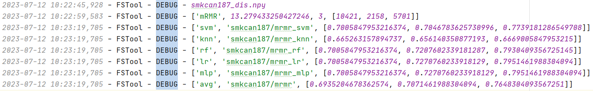

# FSTool
FSTool is a feature selection tool.\
Most Feature selection algorithms are based on Information theory.\
There may be problems with the algorithm implementation, please carefully check when using it.

## Project file Introduction

### 1. dataSet
Save the dataset used in the experiment. \
The dataset occupies a large amount of storage and will not be uploaded temporarily.
### 2. ExperimentalData
The data obtained by each algorithm on the dataset.
### 3. featuresAlgorithm
All implemented algorithms.\
The specific algorithm implemented is as follows:

| Information theory Algorithm | paper   | 
| ----- | --------- |
| Cofs | Feature evaluation and selection with cooperative game theory  | 
| CIFE | Conditional  Infomax Learning: An Integrated Framework for Feature Extraction and Fusion  | 
| Cmifs  | Conditional  Mutual Information-Based Feature Selection Analyzing for Synergy and  Redundancy     |
| Cmim  | Fast  binary feature selection with conditional mutual information     |
| CmiMrmr  | Conditional mutual information-based feature selection algorithm for maximal relevance minimal redundancy     |
| DCSF  | Class-specific  mutual information variation for feature selection     |
| DRGS  | Selection  of interdependent genes via dynamic relevance analysis for cancer diagnosis     |
| DRJMIM  | Feature selection considering two types of feature  relevancy and   feature interdependency     |
| DWFS  | Feature  selection using dynamic weights for classification     |
| FCBF  | Efficient  feature selection via analysis of relevance and redundancy     |
| FCBFCFS  | Feature selection via approximated Markov blankets using the CFS method     |
| IWFS  | A novel  feature selection method considering feature interaction     |
| JMI  | Data  visualization and feature selection: New algorithms for nongaussian data     |
| JMIM  | Feature  selection using Joint Mutual Information Maximisation     |
| Mic  | Detecting Novel Associations in Large Data Sets     |
| MIFS  | Using  mutual information for selecting features in supervised neural net learning     |
| Mim  | Feature  selection and feature extraction for text categorization     |
| MRMD  | Feature redundancy  term variation for mutual information-based feature selection     |
| MRMI  | A feature selection method via analysis of relevance, redundancy, and interaction     |
| mRMR  | Feature  selection based on mutual information: Criteria of maxdependency,  max-relevance, and min-redundancy     |
| RAIW  | A feature selection algorithm based on redundancy analysis and interaction weight     |
| SOA  | Gait Feature Subset Selection by Mutual Information     |
| TwoFS  | Mutual information-based method for selecting informative feature sets     |
| UcrFs  | Feature selection considering Uncertainty Change Ratio of the class label     |

### 4. util
#### classifier 
Seven classifier call methods are implemented.
"svm", "knn", 'gnb', "dt", "rf", "lr", "mlp"
#### data_process
Data preprocessing.
#### log_process
Generation of experimental logs.

#### metrics
Calculation of various metrics.
#### validation
Cross validation implementation.
#### xls_process
Xls file processing function.